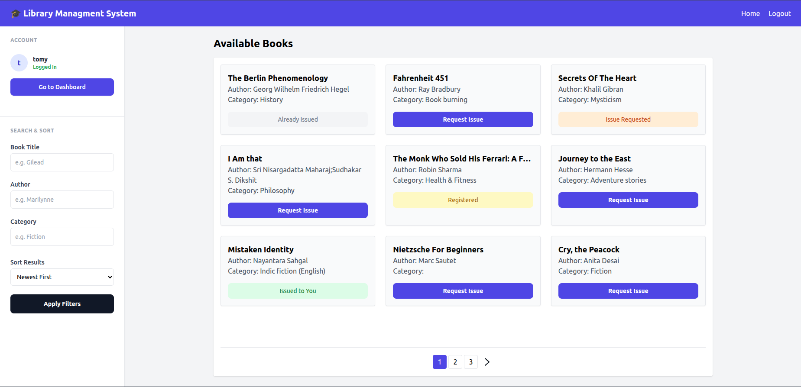
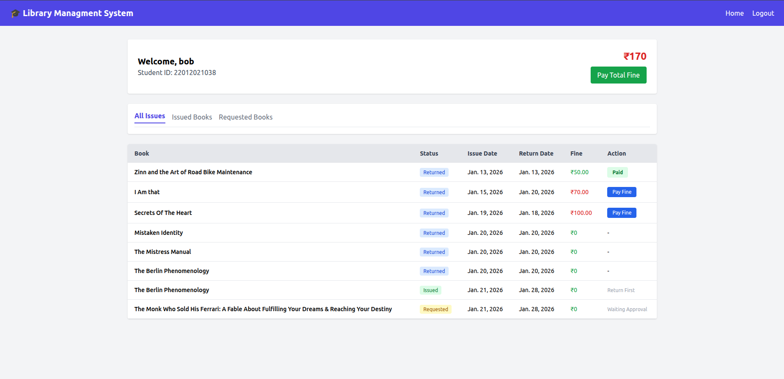
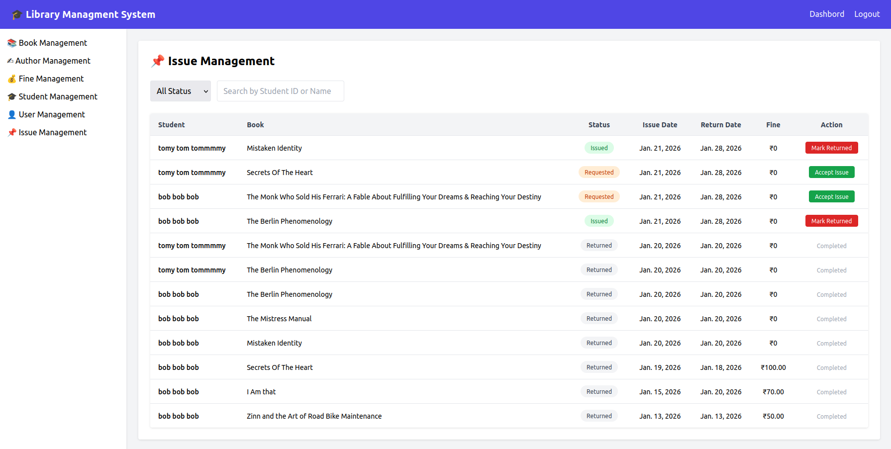
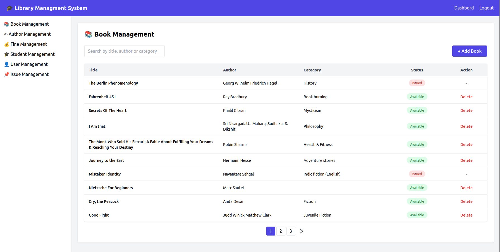
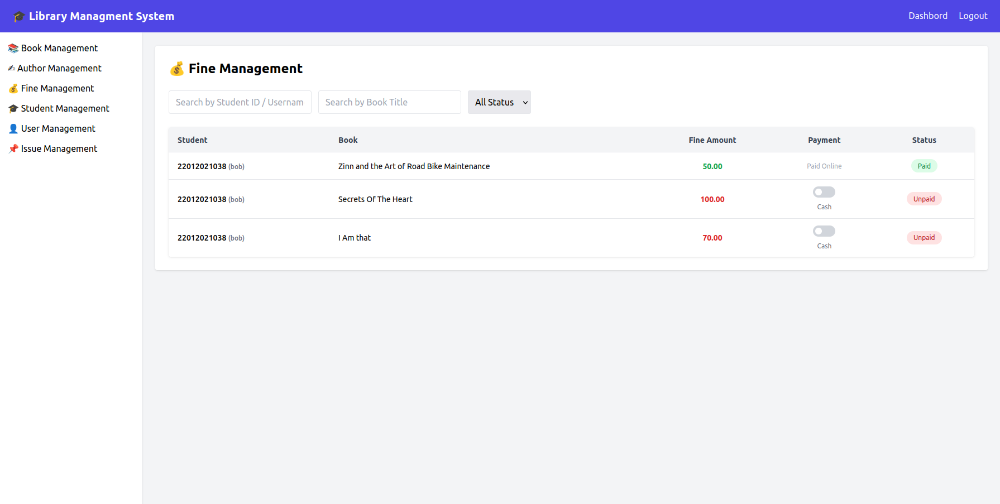

# 📚 Library Management System (Django)


An advanced, full-stack **Library Management System** designed for modern educational institutions. This system streamlines the process of managing books, student memberships, book issues, and fine collections with a focus on real-time interactions and a seamless user experience.

---

## ✨ Key Features

### 🔐 Multi-User Workflows
| Role | Capabilities |
| :--- | :--- |
| **Public** | Browse catalog, search by author/category, and view availability. |
| **Student** | AJAX login, instant book requests, view personal issue history, and track/pay fines. |
| **Admin** | Full dashboard, approve/reject requests, inventory management, and cash payment overrides. |

### 🚀 Technical Highlights
* **Zero Refresh UI:** Powered by AJAX (Fetch API) for requests, logins, and status updates.
* **Dual Payment Gateway:** Integrated **Stripe** for online payments and a **Manual Cash Toggle** for Admin-assisted transactions.
* **Dynamic Fine Logic:** Real-time calculation of overdue days and fine amounts.
* **Responsive Design:** Fully optimized for mobile and desktop using **Tailwind CSS**.

---

## 🛠️ Tech Stack

* **Backend:** Python 3.x, Django 4.x
* **Frontend:** HTML5, Tailwind CSS, JavaScript (ES6+)
* **Database:** SQLite (Development) / PostgreSQL (Production ready)
* **Payments:** Stripe API (Test Mode)
* **Asynchronous:** AJAX / Fetch API

---

## 📂 Project Architecture

```text
library_management_system/
├── account/            # User profiles & authentication
├── book/               # Inventory & categorization
├── issue/              # Borrowing logic & workflows
├── fines/              # Payment processing & fine tracking
├── templates/          # Organized UI components
│   ├── admin/
│   ├── student/
│   └── home.html
├── static/             # Assets (CSS, JS, Images)
└── manage.py
```


## 🖼️ Application Preview

<p align="center">
  
  
</p>

<details>
<summary><b>📸 Click to view more screenshots</b></summary>
<br>

| Issue Management | Book Management |
| :---: | :---: |
|  |  |

| Fine Management |
| :---: |
|  |

</details>

---

## ⚙️ Setup & Installation

Follow these steps to run the project locally:

---

### 1️⃣ Clone the Repository
```bash
git clone https://github.com/your-username/library-management-system.git
cd library-management-system
```

### 2️⃣ Create Virtual Environment
```bash
python -m venv .venv
```
#### Activate the virtual environment:
Linux / macOS

```bash
source .venv/bin/activate
```
Windows
```bash
.venv\Scripts\activate
```

### 3️⃣ Install Dependencies
```bash
pip install -r requirements.txt
```

### 4️⃣ Apply Migrations
```bash
python manage.py makemigrations
python manage.py migrate
```

### 5️⃣ Create Superuser (Admin)
```bash
python manage.py createsuperuser
```

### 6️⃣ Run Development Server
```bash
python manage.py runserver
Open your browser and visit:
```

```text
http://127.0.0.1:8000/
```
## 🔒 Security & Configuration

* **CSRF Protection:** Fully enabled for all **AJAX/Fetch API** requests to prevent cross-site request forgery.
* **Access Control:** Strict role-based permissions implemented using Django **Decorators** and **Mixins** to ensure only authorized users can access specific views.
* **Static Setup:** Ensure `DEBUG=True` is set in `settings.py` during development to properly serve images and assets via `STATICFILES_DIRS`.
* **Payments:** Replace the placeholder `STRIPE_SECRET_KEY` in your `settings.py` with your actual Stripe API credentials for live testing.

---